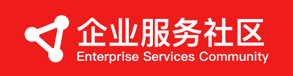

# 企业服务社区（Enterprise Services Community）

记录值得分享的内容。灵感来自[科技爱好者周刊](https://github.com/ruanyf/weekly)

## 2022
**Q1**
- 03.28: [Okteto A 轮融了 1500 万美元，用来颠覆软件团队开发现代应用的方式](https://www.okteto.com/blog/a-15m-series-a-to-disrupt-modern-development/)
- 01.25: [当你发现你达到产品市场匹配的时候你感觉怎么样？ - Lenny Rachitsky](https://www.producthunt.com/stories/what-it-feels-like-when-you-ve-found-product-market-fit-by-lenny-rachitsky)（英文）

## 2021
**Q4**

- 12.31：[【Reform 联合创始人访谈】表单工具 Reform 在 8 个月内就获得了 100 个客户](https://www.failory.com/interview/reform) （英文）
- 12.28：[【Bildr 联合创始人访谈】一体化的无代码平台 Bildr 融了 150 万美金](https://www.failory.com/interview/bildr) （英文）
- 12.28：[【Eldur Studio 创始人访谈】利用无代码技术为客户开发软件 9 个月时间挣了 15 万美金](https://www.indiehackers.com/post/launched-my-own-no-code-agency-and-hit-150k-in-revenue-in-9-months-ama-d620e51dfa) （英文）
- 11.27：[【Tally 创始人访谈】把一个免费的无代码表单工具做到月入 6 千美金](https://www.failory.com/interview/tally) （英文）
